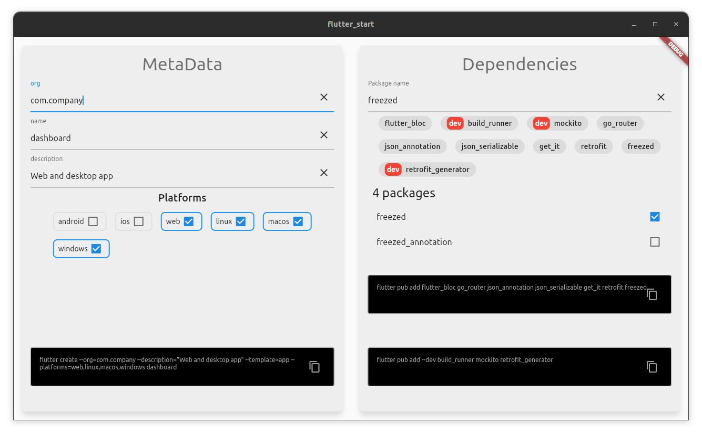

# flutter_start


A Flutter wizard inspired by spring boot starter



## Purpose

Flutter can make many things for you. It can help you to build apps for multiple target platforms like android, ios, linux, macos and windows. 

It can be hard for beginners to compose with all of these options.

This app generates for you `flutter create`, `flutter pub add` commands with few clicks:

* name your package

* name your app

* add a description

* select your dependencies

And voilà !

## Pub.dev API

We use the [pub.dev API](https://pub.dev/help/api) to fetch packages data.

### Get package completion

```bash
curl https://pub.dev/api/package-name-completion-data
```

### Get single package informations

```bash
curl https://pub.dev/api/packages/:packageName
```

### Get single package score informations

```bash
curl https://pub.dev/api/packages/:packageName/score
```

## Generated sources

This project uses generated sources. Type the following command to refresh generated sources

```bash
flutter pub run build_runner build --delete-conflicting-outputs
```

